# Progression Roadmap: Fail Fast Strategy

> **Principle**: Isolate variables, validate incrementally, add complexity only when justified.
> **Clinical Requirement**: Final accuracy must be < 0.025mm (matching GT annotation quality)

---

## Visual Overview

```mermaid
flowchart TD
    %% ========== STYLING ==========
    classDef phase fill:#f0f9ff,stroke:#0369a1,stroke-width:3px,stroke-dasharray:5 0
    classDef success fill:#dcfce7,stroke:#166534,stroke-width:2px
    classDef dataNode fill:#fef3c7,stroke:#d97706
    classDef modelNode fill:#dbeafe,stroke:#1d4ed8
    classDef targetNode fill:#fce7f3,stroke:#be185d
    classDef decision fill:#fef9c3,stroke:#ca8a04
    classDef action fill:#e0e7ff,stroke:#4f46e5
    
    %% ========== MAIN PHASE FLOW ==========
    P1["**PHASE 1**<br/>Prove Concept<br/>Weeks 1-2"]:::phase
    P2["**PHASE 2**<br/>Clinical Range<br/>Weeks 3-4"]:::phase
    P3["**PHASE 3**<br/>Near GT Quality<br/>Weeks 5-6"]:::phase
    P4["**PHASE 4**<br/>Production<br/>Week 7+"]:::phase
    
    P1 -- "✓ Success" --> P2 -- "✓ Success" --> P3 -- "✓ Success" --> P4
    
    %% ========== PHASE 1 DETAILS ==========
    subgraph SG1[" "]
        direction LR
        
        D1["📊 **Data**<br/>Molars Only<br/>~500 cases"]:::dataNode
        M1["⚙️ **Model**<br/>EdgeConv 2-layer"]:::modelNode
        T1["🎯 **Target**<br/>&lt; 0.5mm error"]:::targetNode
        Q1{"❓ Heatmap shows<br/>clear margins?"}:::decision
        
        D1 --> M1 --> T1 --> Q1
        
        Q1 -->|"✗ No"| F1["🛠 Debug features/model"]:::action
        F1 -.-> M1
        Q1 -->|"✓ Yes"| P2
    end
    
    %% ========== PHASE 2 DETAILS ==========
    subgraph SG2[" "]
        direction LR
        
        D2["📊 **Data**<br/>+ Premolars<br/>~1500 cases"]:::dataNode
        M2["⚙️ **Model**<br/>EdgeConv 4-layer<br/>+ Dilated"]:::modelNode
        T2["🎯 **Target**<br/>&lt; 0.1mm error"]:::targetNode
        Q2{"❓ Generalizes to<br/>premolars?"}:::decision
        
        D2 --> M2 --> T2 --> Q2
        
        Q2 -->|"✗ No"| F2["📈 More data /<br/>augmentation"]:::action
        F2 -.-> M2
        Q2 -->|"✓ Yes"| P3
    end
    
    %% ========== PHASE 3 DETAILS ==========
    subgraph SG3[" "]
        direction LR
        
        D3["📊 **Data**<br/>All tooth types<br/>~5k cases"]:::dataNode
        M3["⚙️ **Model**<br/>+ Transformer if needed"]:::modelNode
        T3["🎯 **Target**<br/>&lt; 0.05mm error"]:::targetNode
        Q3{"❓ Approaching<br/>GT quality?"}:::decision
        
        D3 --> M3 --> T3 --> Q3
        
        Q3 -->|"✗ No"| F3["🔍 Architecture<br/>search"]:::action
        F3 -.-> M3
        Q3 -->|"✓ Yes"| P4
    end
    
    %% ========== PHASE 4 DETAILS ==========
    subgraph SG4[" "]
        direction LR
        
        D4["📊 **Data**<br/>Full dataset<br/>~10k cases"]:::dataNode
        M4["⚙️ **Model**<br/>Final architecture"]:::modelNode
        T4["🎯 **Target**<br/>&lt; 0.025mm error"]:::targetNode
        
        D4 --> M4 --> T4 --> Deploy["🚀 **Production Ready**"]:::success
    end
    
    %% ========== CONNECTIONS ==========
    P1 --> SG1
    P2 --> SG2
    P3 --> SG3
    P4 --> SG4
```



---

## Accuracy Targets (Based on GT Data)

Your GT margins show: **Mean: 0.0199mm | Max: 0.0251mm**

| Phase | Target | Meaning |
|-------|--------|---------|
| Phase 1 | < 0.5mm | 20× GT — just prove model learns signal |
| Phase 2 | < 0.1mm | 4× GT — entering clinical relevance |
| Phase 3 | < 0.05mm | 2× GT — near human annotation |
| Phase 4 | < 0.025mm | 1× GT — match annotation quality |

---

## Error Budget (Final < 0.025mm)

```
Total Error Budget: 0.025mm
├── Model prediction:      ~0.015mm (core learning)
├── Curve extraction:      ~0.005mm (post-processing)
└── GT annotation noise:   ~0.005mm (human variance)
```

---

## Phase 1: Prove Concept (Weeks 1-2)

| Aspect | Choice | Rationale |
|--------|--------|-----------|
| **Data** | Molars only, ~500 cases | Clearest margins, consistent anatomy |
| **Model** | EdgeConv (2 layers) + MLP | Simple, fast to train |
| **Output** | Heatmap (margin probability) | Easier than exact curve |
| **Target** | < 0.5mm error | Just prove signal exists |
| **Eval** | Visual inspection + coarse Chamfer | Quick validation |

**Gate**: Heatmap clearly highlights margin region. Error < 0.5mm.

---

## Phase 2: Clinical Range (Weeks 3-4)

| Aspect | Choice | Rationale |
|--------|--------|-----------|
| **Data** | Add premolars, ~1,500 cases | Test tooth type generalization |
| **Model** | EdgeConv (4 layers) + Dilated EdgeConv | Larger receptive field |
| **Output** | Heatmap + curve extraction v1 | Start end-to-end |
| **Target** | < 0.1mm error | Clinical relevance |
| **Eval** | Chamfer distance | Quantitative |

**Gate**: Model works on premolars. Error < 0.1mm.

---

## Phase 3: Near GT Quality (Weeks 5-6)

| Aspect | Choice | Rationale |
|--------|--------|-----------|
| **Data** | All tooth types, ~5,000 cases | Full variety |
| **Model** | Add Transformer encoder if needed | Global context |
| **Output** | Refined curve extraction | Production pipeline |
| **Target** | < 0.05mm error | Near human quality |
| **Eval** | Chamfer + visual review | Quality check |

**Gate**: Error < 0.05mm. Technician says "looks reasonable."

---

## Phase 4: Production (Week 7+)

| Aspect | Choice | Rationale |
|--------|--------|-----------|
| **Data** | Full dataset, ~10,000 cases | Maximum coverage |
| **Model** | Final optimized architecture | Performance tuned |
| **Output** | Production curve output | Exocad-compatible |
| **Target** | < 0.025mm error | Match GT quality |
| **Eval** | Clinical validation | Real workflow test |

**Gate**: Technicians accept AI margins without major edits.

---

## Quick Reference

| Phase | Data | Model | Target Error |
|-------|------|-------|--------------|
| 1 | Molars ~500 | EdgeConv 2L | < 0.5mm |
| 2 | + Premolars ~1.5k | + Dilated | < 0.1mm |
| 3 | All types ~5k | + Transformer? | < 0.05mm |
| 4 | Full ~10k | Final | < 0.025mm |

---

## Decision Points

| Phase Fails | Action |
|-------------|--------|
| Phase 1 | Check curvature features, try different GT encoding |
| Phase 2 | Add more data, augmentation, deeper model |
| Phase 3 | Add Transformer, multi-task learning |
| Phase 4 | Revisit problem formulation, ensemble models |
