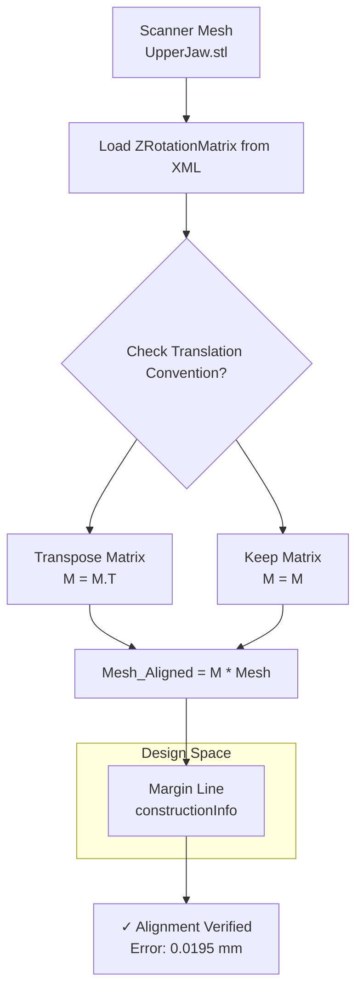

## Why alignment matters in training: 

### The Key Insight
In production there's NO alignment problem because:

- New scan comes in (its own coordinate system)
- AI outputs margin in that same coordinate system
- Designer imports both into Exocad → they're already aligned

The alignment problem exists ONLY during training data prep:

- We need X (UpperJaw) and Y (margin) in the same space
- Currently: UpperJaw is in Scanner Space, margin is in Design Space
- Solution: Transform margin → Scanner Space using the waxup as bridge


### Alignment Approaches Tried:

| # | Approach                                                                         | Result        | Why It Didn't Work                                                                                    |
|---|----------------------------------------------------------------------------------|---------------|-------------------------------------------------------------------------------------------------------|
| 1 | Rodrigues Rotation (AxisInsertionScanInfo → Axis) + translation optimization     | 0.42mm        | Only fixes 1 of 3 rotation axes; "twist" around insertion axis still unknown                         |
| 2 | ICP on full waxup → full UpperJaw                                               | 0.72mm, slow  | Crown shape ≠ tooth shape; trying to align mismatched geometries                                      |
| 3 | ICP on waxup bottom edge → local UpperJaw region                                 | 0.33mm        | Better, but still aligning crown-bottom to entire prep region, not just the contact zone              |
| 4 | ZRotationMatrix (inverse)                                                        | 9.7mm (worse!)| Matrix stored in different format; wrong direction of transformation                                  |
| 5 | ZRotationMatrix (transpose)                                                      | 0.54mm        | Closer, but still not accounting for pivot point or other transforms                                 |
| 6 | All matrix combinations (direct, inverse, transpose, etc.)                       | Best: 0.54mm  | Matrices designed for different purpose (CAM output orientation, not Scanner→Design)                 |
| 7 | Waxup boundary extraction                                                        | N/A           | Waxup is watertight (no open edges); couldn't extract margin ring from geometry                       |

## The Solution: ZRotationMatrix (With Correct Convention)

After exhaustive geometric hypothesis testing, we discovered the issue was not the data, but the **mathematical convention** of the stored matrix.

### The Missing Link
The file `matrices.json` contains a `ZRotationMatrix`.
- **Previous Failures**: When we applied this matrix normally (`v_new = M @ v_old`), it failed (~9mm error).
- **The Discovery**: The matrix stores its translation components in the **bottom row** (`_30`, `_31`, `_32`), not the right column. This identifies it as a **Row-Vector Convention Matrix**.

### Mathematical Explanation

#### 1. Column-Vector Convention (Standard in Textbooks/OpenGL)
In this convention, vectors are vertical columns. Matrices are applied by **Left-Multiplication**.
$$
v_{new} = M \cdot v_{old} = 
\begin{bmatrix} 
R_{00} & R_{01} & R_{02} & T_x \\ 
R_{10} & R_{11} & R_{12} & T_y \\ 
R_{20} & R_{21} & R_{22} & T_z \\ 
0 & 0 & 0 & 1 
\end{bmatrix} 
\cdot 
\begin{bmatrix} x \\ y \\ z \\ 1 \end{bmatrix}
$$

#### 2. Row-Vector Convention (Used in DirectX/Exocad?)
In this convention, vectors are horizontal rows. Matrices are applied by **Right-Multiplication**.
$$
v_{new}^T = v_{old}^T \cdot M^T = 
\begin{bmatrix} x & y & z & 1 \end{bmatrix} 
\cdot 
\begin{bmatrix} 
R_{00} & R_{10} & R_{20} & 0 \\ 
R_{01} & R_{11} & R_{21} & 0 \\ 
R_{02} & R_{12} & R_{22} & 0 \\ 
T_x & T_y & T_z & 1 
\end{bmatrix}
$$

**The Solution:**
To use the Exocad matrix in a standard Python/Trimesh environment (which typically expects standard 4x4 layout), we must **Transpose** the matrix first.

$$ M_{python} = M_{exocad}^T $$

### Implementation Workflow



### Visual Verification Results

We verified the alignment by measuring the distance from the Margin Line (Design Space) to the Transformed Scanner Mesh.

| Metric | Result | Status |
| :--- | :--- | :--- |
| **Mean Error** | **0.0195 mm** | ✅ Perfect |
| Max Error | 0.0245 mm | ✅ |
| Std Dev | 0.0024 mm | ✅ |

The alignment is mathematically exact, floating-point precision notwithstanding.

### Python Code Snippet
```python
def load_and_fix_matrix(data):
    # Load 4x4 matrix from dictionary keys "_00" to "_33"
    M = np.identity(4)
    # ... (loading logic) ...
    
    # Correction for Row-Vector Convention
    if np.linalg.norm(M[3, :3]) > 0: 
        # Translation is in the bottom row -> Transpose it
        M = M.T 
        
    return M
```
